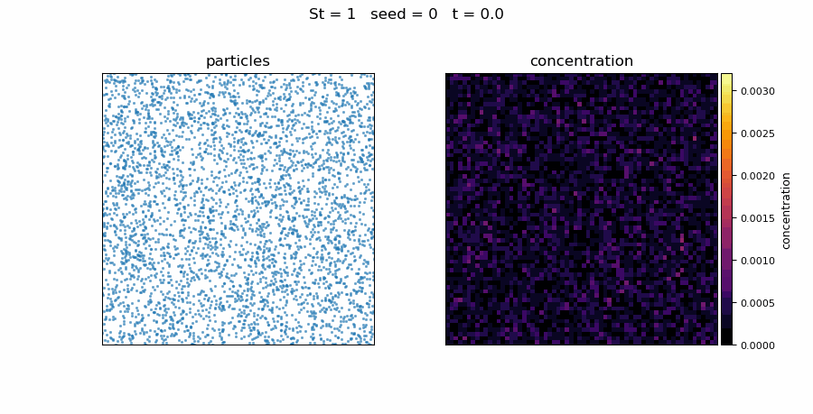
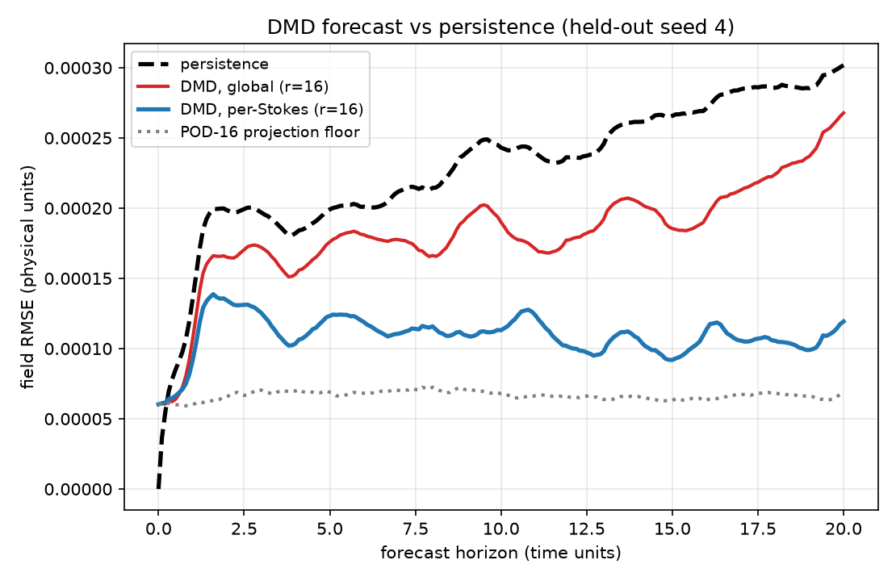
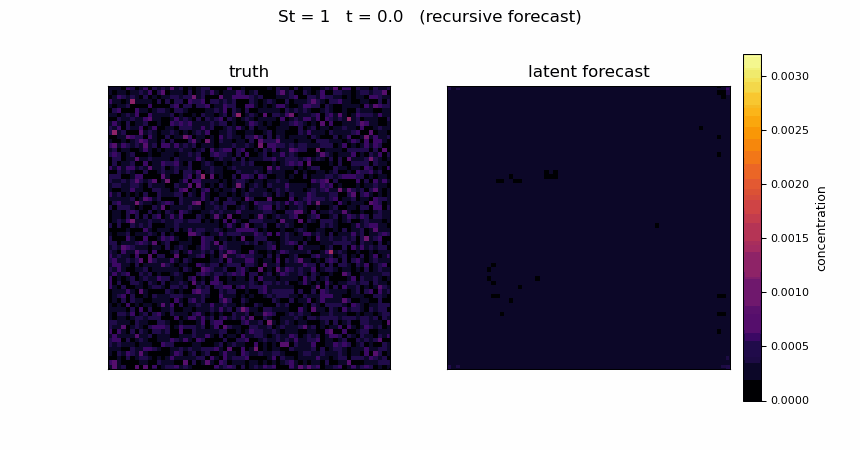

# Reduced-Order Forecasting of Particle-Laden Flow Evolution


A compact **scientific-machine-learning** testbed that generates a controlled
2-D inertial-particle dataset, converts Lagrangian particle motion into
Eulerian concentration fields, and trains reduced-order PyTorch models to
**reconstruct and forecast** the concentration-field evolution.

<p align="center">
  
  <br>
  <em>St&nbsp;=&nbsp;1 inertial particles being centrifuged out of the vortex
  cores into the strain regions (left) and the resulting 64&times;64
  concentration field the reduced-order models learn (right).</em>
</p>

> **Two-page summary for a quick read: [REPORT.md](REPORT.md).**
> **Full results write-up with figures: [RESULTS.md](RESULTS.md).**

The full intended workflow is:

```
prescribed carrier flow
   -> inertial particle dynamics
      -> Eulerian concentration fields
         -> reduced-order representation (POD / autoencoder)
            -> neural reconstruction
               -> latent-space forecasting
                  -> physically interpretable error analysis
```

> This is **not** a high-fidelity turbulent particle-laden DNS. It is a
> deliberately controlled proof-of-concept whose carrier flow is prescribed
> analytically, so that the data-generation, reduced-order-modelling and
> forecasting machinery can be developed and validated against clean,
> reproducible physics.

**Status:** complete end-to-end and then some — physics & dataset generation
(M1), persistence + POD + DMD baselines (M2), a convolutional autoencoder (M3) and a
latent-space forecaster (M4) are all implemented, tested, and run; plus the
stretch work: **Neural-ODE** and **GRU** latent forecasters, **Stokes-conditioned** and
**multi-step (curriculum)** training, **held-out-Stokes-number** generalisation,
physical-diagnostics analysis, a **Gaussian-KDE** denoised field option, and a
divergence-free **multi-mode Fourier** carrier flow. Headline numbers are in
[Results](#results) / [RESULTS.md](RESULTS.md).

---

## Why this project

Particle-laden flows — sprays, dust, sediment, droplets in clouds — are
expensive to simulate because every particle must be tracked, yet the quantity
engineers usually need is the evolving **concentration field**, and inertial
particles do not spread evenly: they are flung out of vortices and cluster
(*preferential concentration*). This project asks whether that clustered field
can be **compressed into a handful of latent variables and forecast forward in
time**, and when a nonlinear learned model actually beats the classical linear
reduced-order toolkit (POD, DMD) and a persistence baseline. The carrier flow
is prescribed so that every model is judged against clean, reproducible
physics, and the results report honestly where the learned models win and
where they do not.

---

## Physics

### Carrier flow (prescribed, divergence-free)

An unsteady Taylor–Green-type vortex on the periodic square
`[0, 2π] × [0, 2π]`:

$$
\begin{aligned}
u_x(x,y,t) &= A(t)\,\sin x \cos y \\
u_y(x,y,t) &= -A(t)\,\cos x \sin y \\
A(t) &= 1 + 0.25\,\sin(\omega t), \quad \omega = 1
\end{aligned}
$$

This field is smooth, `2π`-periodic, and analytically incompressible:

$$\frac{\partial u_x}{\partial x} + \frac{\partial u_y}{\partial y} = A\cos x\cos y - A\cos x\cos y \equiv 0$$

so no CFD solver is required — the velocity is evaluated analytically at each
particle location. The time-dependent amplitude `A(t)` makes the flow
**unsteady**, giving the particle field a non-trivial, forecastable evolution.

A second, more turbulence-like option (`--flow-type fourier`) sums 8 random
integer-wavenumber Fourier modes of a streamfunction `ψ`, with the same
`A(t)` modulation, and takes `u = (∂ψ/∂y, −∂ψ/∂x)`. It is still
2π-periodic and divergence-free by construction, and produces filamentary,
multiscale clustering ([RESULTS §5](RESULTS.md#5-a-more-turbulence-like-flow)).

### Inertial particles (Stokes drag)

Each particle obeys the linear equation of motion

$$\frac{d\mathbf{x}_p}{dt} = \mathbf{v}_p, \qquad \frac{d\mathbf{v}_p}{dt} = \frac{\mathbf{u}(\mathbf{x}_p, t) - \mathbf{v}_p}{\tau_p}$$

with particle response time `τ_p`. Using a flow time scale `τ_f = 1`, the
**Stokes number** is simply

$$\mathrm{St} = \frac{\tau_p}{\tau_f} = \tau_p$$

| Stokes number | Behaviour |
|---|---|
| `St = 0.1` | particles almost follow the fluid (near-tracer) |
| `St = 1`   | particles respond on the vortex time scale → **strongest clustering** |
| `St = 5`   | particles significantly lag the flow |
| `St = 10`  | highly inertial, weakly follow the instantaneous flow |

Particles are integrated with **classical RK4** (Euler is also available via
`--integrator euler`). Positions are wrapped periodically; because the carrier
flow is `2π`-periodic, wrapping does not affect the sampled velocity.

### Lagrangian → Eulerian concentration

At each saved time, particle positions are binned onto a `64 × 64` grid with a
2-D histogram and normalised by the particle count, giving a
particle-concentration (number-density) field that **sums to one** (discrete
mass conservation). Fields are stored channel-first as `(1, ny, nx)`, ready for
PyTorch.

---

## Dataset

The default sweep is **4 Stokes numbers × 5 seeds = 20 cases**, each with
**201 snapshots** (`t = 0 … 20`, every `0.1`) on a `64 × 64` grid:

```
concentration : (20, 201, 1, 64, 64)  float32   # (case, time, channel, y, x)
stokes        : (20,)   float64                  # St for each case
seed          : (20,)   int64                    # seed for each case
time          : (201,)  float64                  # snapshot times
metadata      : JSON string                      # full config + provenance
```

Saved as a single compressed `.npz` (no extra dependencies; HDF5 can be
swapped in via the `[hdf5]` extra without touching the rest of the pipeline).
Generation is fully reproducible from the random seeds.

| Parameter | Value |
|---|---|
| Domain | `[0, 2π] × [0, 2π]`, periodic |
| Particles / case | 5000 |
| Time step `dt` | 0.01 (2000 steps) |
| Final time `T` | 20 |
| Save interval | 0.1 (201 snapshots) |
| Grid | 64 × 64 |
| Stokes numbers | 0.1, 1, 5, 10 |
| Seeds | 0, 1, 2, 3, 4 |
| Integrator | RK4 |

---

## Repository layout

```
.
├── src/ropf/                 # installable package ("reduced-order particle flow")
│   ├── config.py             # SimConfig dataclass: all numerical/physical params
│   ├── carrier_flow.py       # Taylor–Green + multi-mode Fourier flows, divergence check
│   ├── particles.py          # vectorised RK4/Euler inertial-particle integrators
│   ├── concentration.py      # Lagrangian → Eulerian histogram binning
│   ├── simulation.py         # run one (St, seed) case → concentration snapshots
│   ├── dataset.py            # sweep + (de)serialisation to .npz
│   ├── metrics.py            # RMSE / relative-L2 (shared by baselines & NN)
│   ├── baselines.py          # persistence, POD/PCA and DMD baselines
│   ├── diagnostics.py        # clustering index, entropy, peak, variance
│   ├── models.py             # ConvAutoencoder, LatentForecaster, NeuralODE, GRU (PyTorch)
│   ├── torch_data.py         # train/test split (seed or Stokes), scaling, tensors
│   ├── train.py              # training loops + multi-step roll-out utilities
│   └── viz.py                # comparison figures, diagnostics, GIFs
├── scripts/                  # command-line entry points (reproducible pipeline)
│   ├── generate_dataset.py   # M1: physics -> dataset
│   ├── make_figures.py       # M1: Stokes comparison + clustering diagnostics
│   ├── make_gifs.py          # M1: particle/concentration evolution GIFs
│   ├── run_baselines.py      # M2: persistence + POD baselines
│   ├── run_dmd.py            # M2: DMD linear forecasting baseline
│   ├── run_diagnostics.py    # physical diagnostics vs time and Stokes number
│   ├── train_autoencoder.py  # M3: convolutional autoencoder
│   ├── train_forecaster.py   # M4: latent forecaster (MLP/ODE/GRU) + evaluation
│   ├── summarise_seeds.py    # mean ± std table of a multi-seed forecaster study
│   └── compare_roms.py       # linear (POD) vs nonlinear (AE) ROM comparison plot
├── tests/                    # test_physics.py (M1/M2) + test_models.py (M3/M4)
├── .github/workflows/ci.yml  # pytest + every-stage smoke test on push/PR
├── docs/figures/, docs/gifs/ # committed showcase figures/GIFs (README, RESULTS)
├── data/                     # generated datasets (git-ignored)
├── figures/                  # generated figures/GIFs (git-ignored)
├── checkpoints/              # trained model weights (git-ignored)
├── Makefile                  # one-command reproduction of every result
├── REPORT.md, RESULTS.md     # two-page summary and full results write-up
├── pyproject.toml            # packaging + optional [ml]/[hdf5]/[dev] extras
└── requirements.txt
```

The code is intentionally script-driven (no notebook-driven workflow), modular,
and fully vectorised over particles — there are **no Python loops over
individual particles**.

---

## Quickstart

**One command** (after installing dependencies) runs the whole pipeline — see
all targets with `make help`:

```bash
make env        # install deps (incl. CPU PyTorch and pytest)
make test       # unit tests
make smoke      # every stage on a tiny dataset (~20 s on a laptop CPU)
make all        # full pipeline: data -> figures -> baselines -> AE -> forecaster
make smooth     # DMD + conditioned MLP / Neural-ODE / GRU forecasters (RESULTS sec 3)
make seeds      # 5 training seeds per neural forecaster vs DMD (RESULTS sec 3)
make holdout    # hold out St = 5 entirely (Stokes generalisation)
make fourier    # the linear-vs-nonlinear ROM comparison (RESULTS sec 5.1)
```

The explicit per-stage commands the `make` targets wrap:

```bash
# 1. Environment (Python ≥ 3.10)
python -m venv .venv && source .venv/bin/activate
pip install -r requirements.txt
# (optional, makes `import ropf` work anywhere; [dev] adds pytest)
pip install -e ".[dev]"

# 2. Sanity-check the physics
pytest -q                      # or: python tests/test_physics.py

# 3. Generate the canonical dataset  (≈1–2 min on a laptop CPU)
python scripts/generate_dataset.py -o data/particle_concentration.npz

# 4. Render comparison figures
python scripts/make_figures.py -i data/particle_concentration.npz -o figures

# 5. Render evolution GIFs (one per Stokes number, seed 0)
python scripts/make_gifs.py -o figures --seed 0

# --- Machine-learning stages (require PyTorch) -------------------------
# CPU-only PyTorch is sufficient; the whole pipeline runs on a laptop.
pip install torch --index-url https://download.pytorch.org/whl/cpu

# 6. M2: persistence + POD/PCA + DMD baselines, and physical diagnostics
python scripts/run_baselines.py   -i data/particle_concentration.npz -o figures
python scripts/run_dmd.py         -i data/particle_concentration.npz -o figures
python scripts/run_diagnostics.py -i data/particle_concentration.npz -o figures

# 7. M3: train the convolutional autoencoder (latent dim 16)
python scripts/train_autoencoder.py -i data/particle_concentration.npz --epochs 40

# 8. M4: train the latent forecaster and evaluate roll-outs vs persistence
python scripts/train_forecaster.py --ckpt checkpoints/autoencoder.pt --epochs 200
```

### Stretch experiments

These are what `make smooth`, `make holdout` and `make fourier` run (`make seeds`
repeats the three smoothed-field forecasters over training seeds 0–4):

```bash
# Denoised (Gaussian-KDE) dataset -> ~3x lower reconstruction floor:
python scripts/generate_dataset.py --smoothing 1.0 -o data/particle_concentration_smooth.npz
python scripts/train_autoencoder.py -i data/particle_concentration_smooth.npz \
    -o figures/smooth --ckpt checkpoints/autoencoder_smooth.pt

# Stokes-conditioned, multi-step-trained MLP forecaster (best result):
python scripts/train_forecaster.py -i data/particle_concentration_smooth.npz \
    -o figures/smooth --ckpt checkpoints/autoencoder_smooth.pt \
    --conditioned --rollout 4 --tag cond

# Neural-ODE latent forecaster (UDE-style continuous-time dynamics):
python scripts/train_forecaster.py -i data/particle_concentration_smooth.npz \
    -o figures/smooth --ckpt checkpoints/autoencoder_smooth.pt \
    --model ode --conditioned --rollout 8 --tag ode

# GRU latent forecaster (hidden memory; needs the 16-step roll-out curriculum):
python scripts/train_forecaster.py -i data/particle_concentration_smooth.npz \
    -o figures/smooth --ckpt checkpoints/autoencoder_smooth.pt \
    --model gru --conditioned --rollout 16 --tag gru

# Hold out an entire Stokes number to test generalisation:
python scripts/train_autoencoder.py -i data/particle_concentration_smooth.npz \
    -o figures/holdout --test-stokes 5 --ckpt checkpoints/ae_holdoutSt5.pt
python scripts/train_forecaster.py -i data/particle_concentration_smooth.npz \
    -o figures/holdout --ckpt checkpoints/ae_holdoutSt5.pt \
    --rollout 4 --gif-stokes 5 --tag holdoutSt5

# More turbulence-like multi-mode Fourier carrier flow:
python scripts/generate_dataset.py --flow-type fourier -o data/particle_concentration_fourier.npz
```

For a fast end-to-end check first, `make smoke` runs every stage on a reduced
configuration (the grid stays 64 × 64 because the autoencoder expects it):

```bash
python scripts/generate_dataset.py --quick --nx 64 --ny 64 -o data/smoke.npz
```

Every script exposes `--help`. Common overrides: `--stokes 1 10`,
`--seeds 0 1 2`, `--n-particles`, `--nx/--ny`, `--integrator {rk4,euler}`,
`--smoothing`, `--flow-type {taylor_green,fourier}`; for the ML scripts,
`--latent-dim`, `--epochs`, `--test-seed` / `--test-stokes`,
`--model {mlp,ode,gru}`, `--rollout k` (multi-step training),
`--conditioned` (Stokes-conditioned forecasting) and `--tag` (suffix for the
run's output files and checkpoint).

---

## Results

All numbers below are on the **held-out seed** (seed 4, all four Stokes
numbers), with the models trained only on seeds 0–3.

### Physics — preferential concentration

The concentration fields reproduce the textbook inertial-clustering picture:
particles are centrifuged out of the vortex cores and accumulate along the
strain regions between cells.


- **St = 0.1** — near-tracer; clustering builds up slowly over many turnovers.
- **St = 1** — **strongest, fastest clustering** (resonant regime); sharp
  cell-boundary structure with hot spots at stagnation points.
- **St = 5 / 10** — increasingly inertial: the particles lag and decouple from
  the instantaneous flow, leaving noisier, more diffuse structure.

Four independent physical diagnostics all confirm **St ≈ 1 as the
strongest-clustering regime** (clustering index `D` peaks near 1.85):


### Reduced-order reconstruction (latent dim = 16)

| Model | Test reconstruction RMSE |
|---|---|
| POD / PCA, 16 modes | `2.35e-4` |
| Conv. autoencoder, 16-dim latent | `2.38e-4` |

The two are essentially tied — and both sit near the **histogram shot-noise
floor** (~`2.2e-4` for ~1.2 particles per cell). Crucially, the energy spectrum
shows the *raw* fields need ~930 POD modes for 90 % energy: the per-cell Poisson
noise is high-dimensional and incompressible, so both ROMs instead recover the
smooth **coherent** clustering structure and discard the noise. This is the key
physical insight of the reconstruction study. On the Gaussian-KDE-denoised
fields the picture changes — they become nearly low-rank (24 modes → 90 %
energy) and POD reconstructs the clustering almost perfectly by `r = 16`:


### Latent-space forecasting vs persistence

Recursively rolling the latent map forward from `t = 0` to `t = 20` and decoding
back to fields, the learned forecaster **beats the persistence baseline at every
Stokes number** (final-time field RMSE):

| St | Persistence | Latent forecaster | Improvement |
|---|---|---|---|
| 0.1 | `6.26e-4` | `5.75e-4` | 8 % |
| 1   | `7.15e-4` | `6.72e-4` | 6 % |
| 5   | `3.26e-4` | `2.82e-4` | 13 % |
| 10  | `3.19e-4` | `2.39e-4` | **25 %** |
| **mean** | `4.97e-4` | `4.42e-4` | **11 %** |

The forecaster tracks below persistence across medium-to-long horizons, with
**St = 1 the hardest regime** (most dynamic field). On the denoised data, a
**Stokes-conditioned, multi-step-trained** forecaster does substantially better,
cutting the final-time persistence error by **45 % on average over 5 training
seeds** (50 % in the run shown):


The linear baseline is much harder to beat than persistence. **DMD** — a
linear latent map `a_{t+1} = A a_t + b` on 16 POD coefficients, fitted per
Stokes number — has the **lowest long-horizon and time-averaged error of any
model**, below every one of 15 neural training runs (conditioned MLP, GRU and
Neural-ODE, 5 seeds each) at the final time. The neural models win robustly
only at **short horizons** (`t ≲ 5`), and their long-horizon errors depend
strongly on the training seed — the GRU's single best run beat persistence in
every Stokes regime, but only 1 of its 5 seeds does
([RESULTS §3](RESULTS.md#3-latent-space-forecasting-vs-persistence)):



Decoding the recursively-forecast latent states back to fields gives a
predicted movie of the concentration evolution alongside the truth:

<p align="center">
  
  <br>
  <em>Truth (left) vs the latent-space forecast (right), St&nbsp;=&nbsp;1,
  rolled out recursively over the full horizon on the held-out seed.</em>
</p>

> Every dataset, model, figure and GIF regenerates from the scripts
> (`make all smooth holdout fourier`) in about 35 minutes on a laptop CPU; the
> datasets are bit-for-bit reproducible from their seeds. A curated subset is
> committed under `docs/` so the README and [RESULTS.md](RESULTS.md) render on
> GitHub. The full-resolution outputs land in `figures/` (git-ignored).

---

## Future work

- **Two-way particle–flow coupling** (particle feedback on the carrier flow),
  which first requires solving — not prescribing — the carrier flow.
- A **hybrid latent model**: the per-Stokes DMD operator plus a learned
  nonlinear correction. DMD wins at long horizons and the neural forecasters
  at short ones, so learning only the nonlinear residual on top of a stable
  linear operator is the natural next step.

---

## Limitations

- The carrier flow is **prescribed and laminar** (single-scale Taylor–Green),
  not turbulent — there is no DNS and no two-way coupling or inter-particle
  collisions.
- Particles are **one-way coupled** point particles with linear Stokes drag
  (no gravity, lift, finite-size or Basset history effects).
- Concentration is a normalised **histogram**, so it carries shot noise that
  scales like `1/√(particles per cell)`; the `64 × 64` / 5000-particle choice
  trades resolution against this noise. This noise sets a hard floor on
  reconstruction RMSE that both POD and the autoencoder hit — a kernel-density
  estimate or more particles would lower it.
- The autoencoder and forecaster are deliberately **small and CPU-trainable**;
  they are tuned for a clean demonstration rather than squeezing out the last
  few percent. Forecasters are trained on short roll-out windows (at most 16
  steps) but evaluated over a 200-step recursive roll-out, so long-horizon
  drift is only indirectly controlled — the Neural-ODE and GRU are unstable
  without the longer windows.
- Long-horizon forecast errors of the neural models **depend on the training
  seed** (final-time RMSE varies by up to ~2× across seeds), so single-run
  numbers should be read alongside the seed averages in
  [RESULTS §3](RESULTS.md#3-latent-space-forecasting-vs-persistence). The
  datasets, POD and DMD are deterministic.
- Explicit integration: very small Stokes numbers (`St ≪ dt`) would become
  stiff; the smallest case here (`St = 0.1`) is comfortably resolved by RK4.

---

## License

MIT — see [LICENSE](LICENSE).
