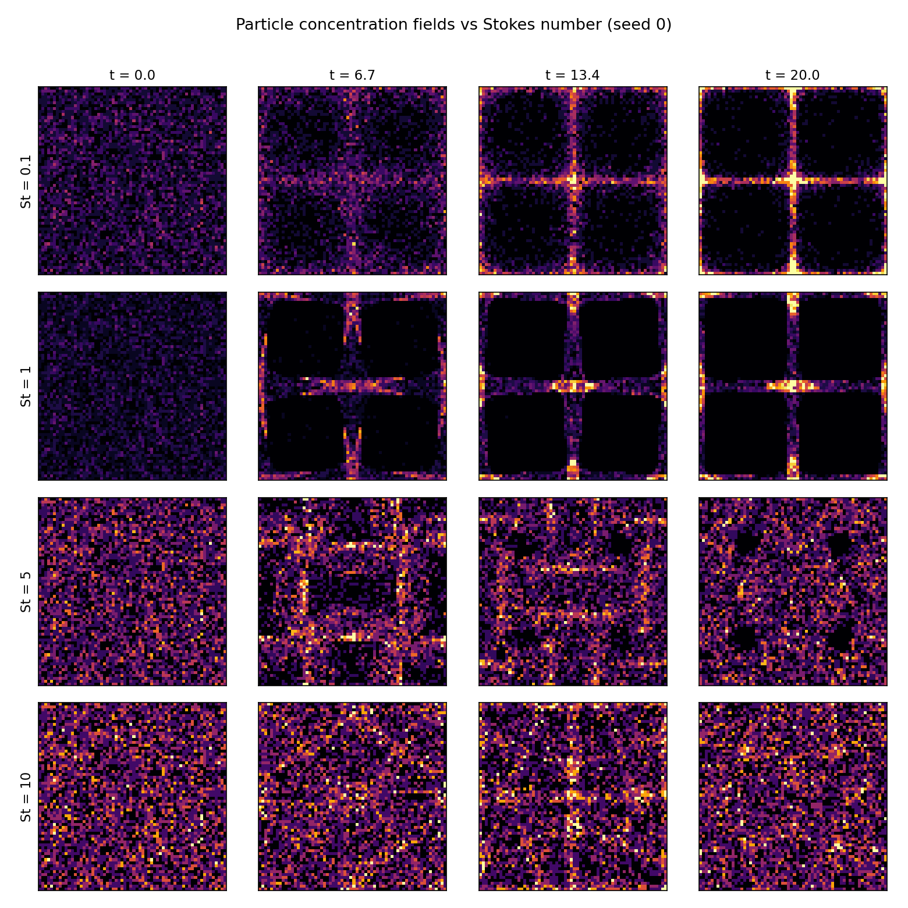
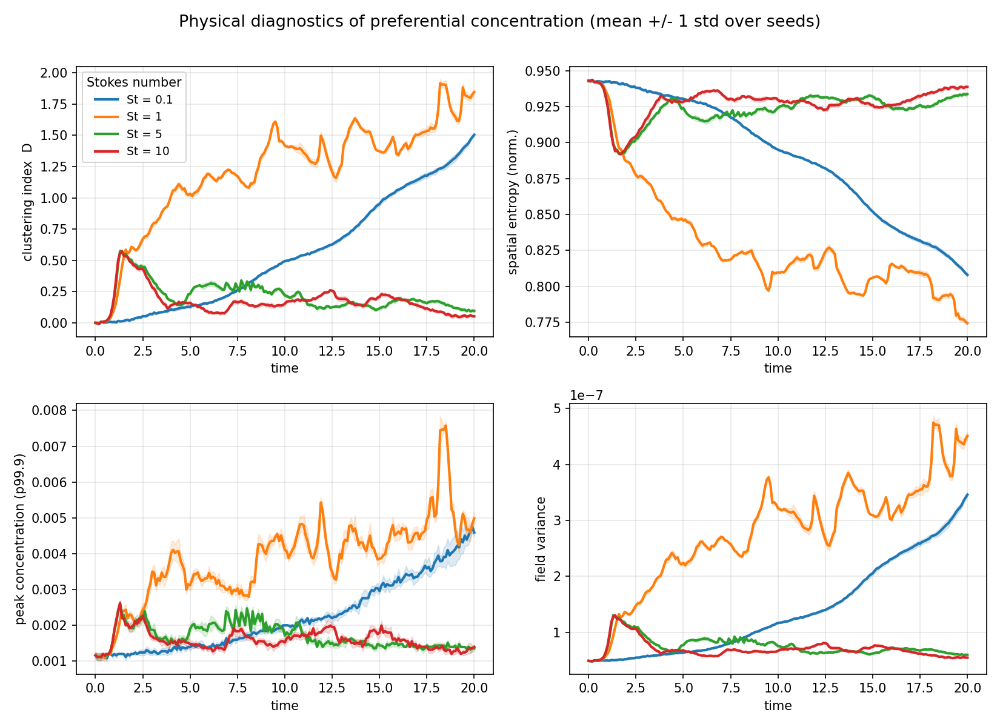
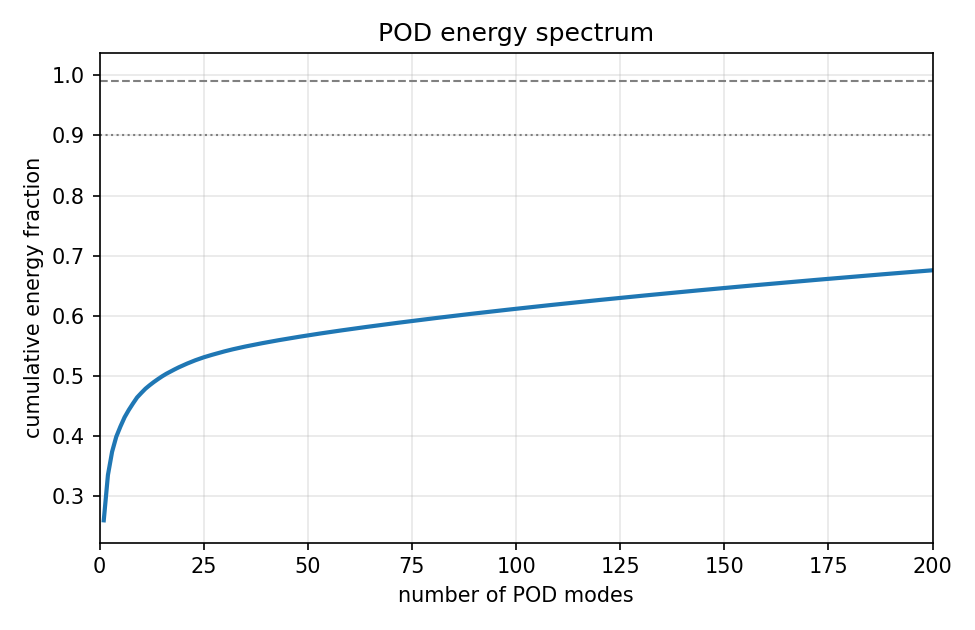
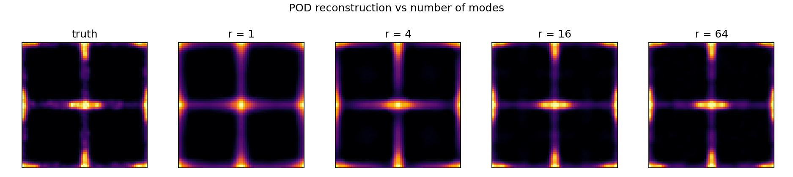
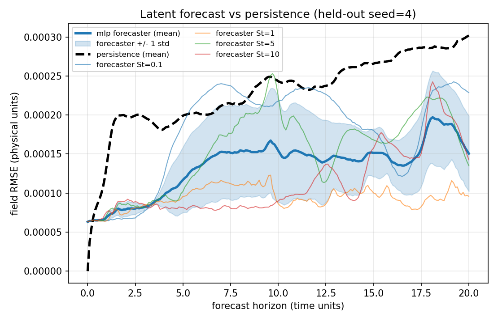
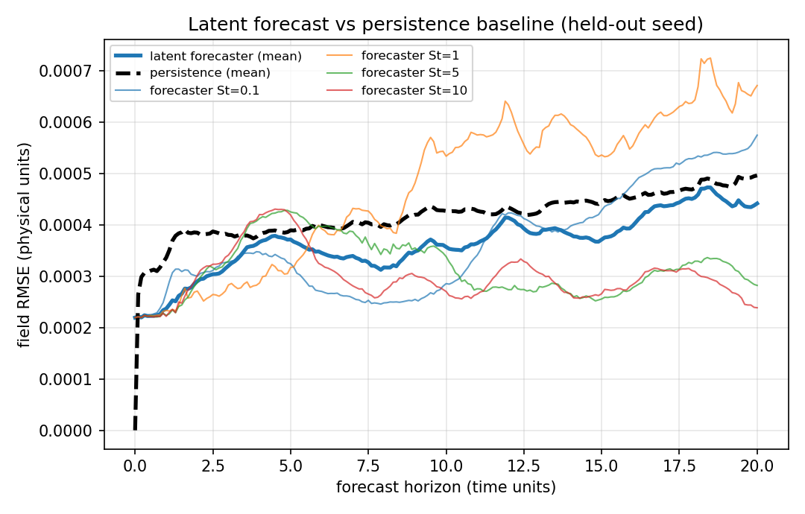
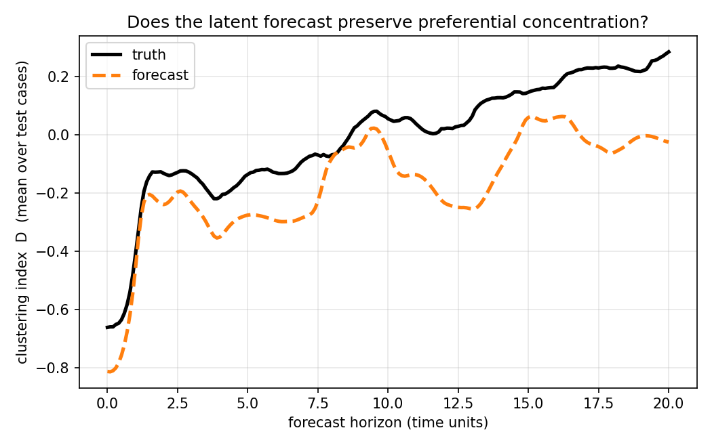
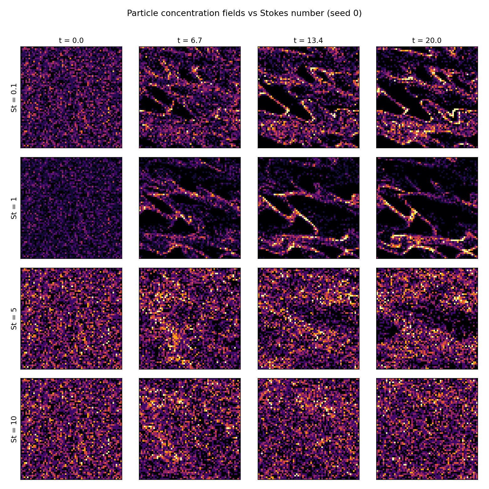

# Results

A walk-through of the experiments, with the headline numbers and the figures
they come from. Unless stated otherwise, models are trained on four Stokes
numbers and seeds 0–3, and **evaluated on the held-out seed 4**. "Physical
units" means the original normalised concentration (each field sums to 1, so
typical values are ~`1/4096 ≈ 2.4e-4`).

Two dataset variants are used:

| Variant | Field generation | Why |
|---|---|---|
| **raw** | 64×64 histogram of 5000 particles | the honest, shot-noise-limited measurement |
| **smooth** | same, then a periodic Gaussian KDE (`sigma = 1` cell) | a denoised, near-low-rank representation for the ROMs |

---

## 1. Physics: preferential concentration

Inertial particles are centrifuged out of the vortex cores and accumulate
along the strain regions between cells. Four independent physical diagnostics
all identify **St ≈ 1 as the strongest-clustering (resonant) regime**, with
St = 0.1 accumulating slowly and St = 5, 10 decoupling from the instantaneous
flow:

The **clustering index** `D = (σ_n − √⟨n⟩)/⟨n⟩` (deviation of per-cell counts
from a random Poisson field) peaks near `1.85` for St = 1; spatial entropy is
correspondingly lowest. Error bands are ±1 std over seeds and are tight — the
clustering statistics are robust.

---

## 2. Reduced-order reconstruction (latent dim = 16)

| Dataset | POD (16 modes) | Conv. autoencoder (16-dim) | Modes for 90 % energy |
|---|---|---|---|
| raw    | `2.35e-4` | `2.38e-4` | **934** |
| smooth | `6.69e-5` | `7.42e-5` | **24** |

**On the raw data**, POD and the autoencoder *tie* — and both sit at the
**histogram shot-noise floor** (~`2.2e-4` for ~1.2 particles/cell). The raw
fields are not compressible by *any* low-rank basis: 934 POD modes are needed
for 90 % energy because the per-cell Poisson noise is high-dimensional.

**Smoothing changes everything**: the denoised fields are nearly low-rank
(24 modes → 90 % energy), so both ROMs improve ~**3×**. On these smooth,
low-rank fields linear POD is *near-optimal* and marginally beats the small
CAE at equal latent budget — a genuine, defensible result (the nonlinear
advantage would be expected to appear on more strongly multiscale fields, e.g.
the Fourier flow in §5). POD reconstructs the clustering structure almost
perfectly by r = 16:

**Generalisation across Stokes number.** An autoencoder trained on
St = {0.1, 1, 10} reconstructs the *completely unseen* St = 5 at `9.7e-5` —
only marginally above the in-distribution `7.4e-5`. The learned field
representation generalises across the inertia parameter.

---

## 3. Latent-space forecasting vs persistence

The forecaster advances the field **entirely in latent space**
(`z_t → z_{t+1}`), is rolled out recursively from `t = 0` to `t = 20`, then
decoded back to fields. Final-time field RMSE on the held-out seed:

| Forecaster | Dataset | Forecast | Persistence | Improvement |
|---|---|---|---|---|
| residual MLP, 1-step | raw | `4.42e-4` | `4.97e-4` | 11 % |
| **conditioned MLP, rollout-4** | smooth | **`1.51e-4`** | `3.02e-4` | **50 %** |
| Neural-ODE, conditioned, rollout-8 | smooth | `2.32e-4` | `3.02e-4` | 23 % |

On the denoised data the **Stokes-conditioned, multi-step-trained MLP** is the
clear winner — it tracks well below persistence across almost all horizons
(crossover at ~3.5 time units, where the autoencoder reconstruction floor
stops dominating):

For comparison, the raw-data one-step forecaster (a weaker 11 % gain, capped by
the shot-noise floor):

**Neural ODE (the UDE bridge).** Parameterising the latent dynamics as a
continuous-time field `dz/dt = f(z, St)` integrated by RK4 is the direct
fluids analogue of the Universal-Differential-Equation machinery. Out of the
box it was **unstable** over the 200-step recursive roll-out (the clustering
index blew up to `2.4` vs a true `0.29`). Adding Stokes conditioning and
training on longer (8-step) roll-outs stabilised it: it now beats persistence
and roughly preserves the clustering index, slightly under-diffusing it:

**An honest limitation — forecasting an unseen Stokes number.** When St = 5 is
held out *entirely*, the unconditioned forecaster loses to persistence
(`4.18e-4` vs `1.18e-4`): it cannot extrapolate dynamics to an inertia regime
it never saw, and St = 5 is nearly stationary so persistence is hard to beat.
Reconstruction generalises across St; autoregressive *dynamics* do not, without
conditioning. This cleanly motivates the conditioned model.

---

## 4. Summary of what beats what

- **Reconstruction:** noise floor dominates the raw data (POD = CAE); smoothing
  buys a 3× lower floor and makes the fields low-rank, where POD is near-optimal.
- **Forecasting:** the latent forecaster beats persistence whenever there is
  coherent low-rank structure to predict; the best model (conditioned, rollout-4
  MLP) halves the persistence error. Persistence only wins at very short
  horizons or for near-stationary, unseen regimes.
- **Generalisation:** the encoder/decoder transfers to an unseen Stokes number;
  the dynamics need conditioning to do the same.

---

## 5. A more turbulence-like flow

Swapping the single-mode Taylor–Green vortex for a divergence-free **multi-mode
random-Fourier streamfunction** flow produces much richer, filamentary
clustering (curved ligaments and voids rather than a regular cell grid) — a
natural next testbed where a *nonlinear* autoencoder is more likely to beat the
linear POD basis:

Reproduce with `python scripts/generate_dataset.py --flow-type fourier`.
